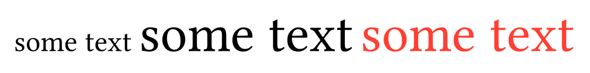

# TypstGenerator

[](https://github.com/onecalfman/TypstGenerator.jl/actions/workflows/CI.yml?query=branch%3Amain)

This package can be used to generate [Typst](https://typst.app/home) through julia code.

## Basic usage
The function naming follows the typst function names.

```julia
using TypstGenerator
t1 = text("some text")
t2 = text("some text", size = 20pt)
t3 = text("some text", size = 20pt, fill = :red)
```

A difference from typst however is, that the content always comes first.
An arbitrary number of named arguments can be supplied. These will just
be converted into typst syntax. This package currently doesn't check
the validity of the supplied option in julia itself.
Refer to the typst documentation eg. [text](https://typst.app/docs/reference/text/text/) for valid options.

The elements are then rendered to String using the typst function.

```julia
typst([t1,t2,t3])
```




### Listlike
Elements like grid, table or page accept lists of typst arguments.

```julia
t = grid(map(x -> text("field $(x)"), 1:4),
    columns = [fr(1), fr(2), 20mm]
)
write("test.typ", typst(t))
```

