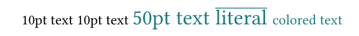
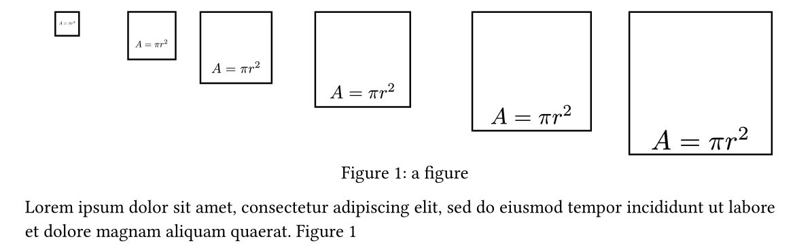

# TypstGenerator

[](https://github.com/onecalfman/TypstGenerator.jl/actions/workflows/CI.yml?query=branch%3Amain)

This package can be used to generate [Typst](https://typst.app/home) through julia code.

## Basic usage
The function naming follows the typst function names.

```julia
using TypstGenerator
t1 = text("some text")
t2 = text("some text", size = 20pt)
t3 = text("some text", size = 20pt, fill = :red)
```

A difference from typst however is, that the content always comes first.
An arbitrary number of named arguments can be supplied. These will just
be converted into typst syntax. This package currently doesn't check
the validity of the supplied option in julia itself.
Refer to the typst documentation eg. [text](https://typst.app/docs/reference/text/text/) for valid options.

The elements are then rendered to String using the typst function.

```julia
typst([t1,t2,t3])
```


### Listlike
Elements like grid, table or page accept lists of typst arguments.

```julia
block([
grid([map(x -> text("field $(x)"), 1:3)...],
    columns = [fr(1), fr(2), fr(5)],
    row_gutter = 3mm,
),
line(length = 0.5),
grid([map(x -> text("field $(x)"), 4:12)...],
    columns = [fr(1), fr(2), fr(5)],
    row_gutter = 3mm,
)
])
```


Column or row width can be specified using the fr function, following
the css flex logic.
Multiple columns with the same fraction can also be constructed with fr(1,n).
Note that arguments, that are written with a - in typst are written with _ in julia.
Floats are interpretted as percent when given as an named argument.

### set

```julia
block([
    set(text, size = 10pt),
    text("10pt text"),
    text("10pt text"),
    set(text, size = 15pt, fill = cmyk(0.9,0.2,0.4,0.2)),
    text("50pt text"),
    literal("#overline[literal]"),
    set(text, size = 10pt),
    text("colored text"),
])
```


Set syntax works pretty similar to typst itself.
For arbitrary typst commands use the literal function.

### figures
```julia
page([
    figure(
        grid(map(x -> square(
            align(
                scale(
                    math(" A = pi r^2 "), 
                x = x/20, y = x/20), 
            :bottom), 
            size = x * mm), 5:5:30),
        columns = [fr(1,3)...,fr(2,3)...],
        ),
        label = :label1,
        caption = text("a figure")
    ),
    lorem(20),
    ref(:label1)
])
```

Figures can be referenced, using the label option with some symbol.



### Example
Check the example folder for a more complex and comprehensive example.

For a full list of functions check the TypstGenerator.jl file.

## Things that don't yet work.
- Text styles besides text. As of today only text is implemented.
  Empy, overline etc are not yet supported.
- References when a figure is in an align.
- repeat
- measure
- move
- counter
- layout
- locate
- query
- selector
- state
- style